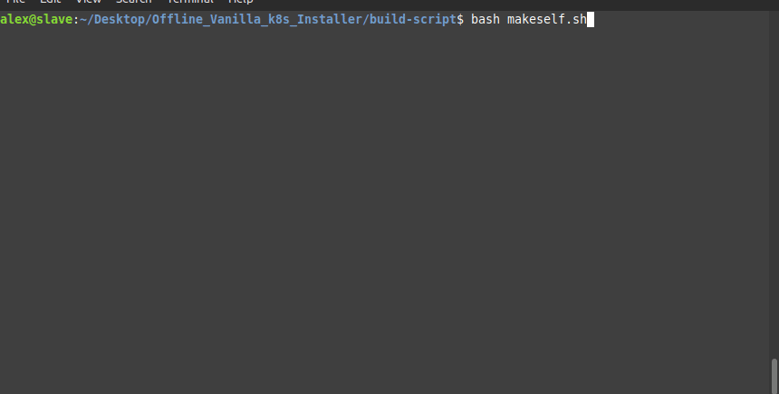
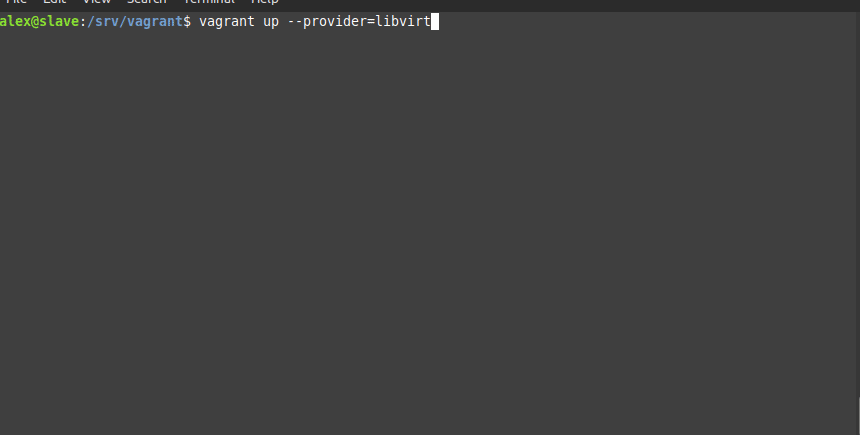
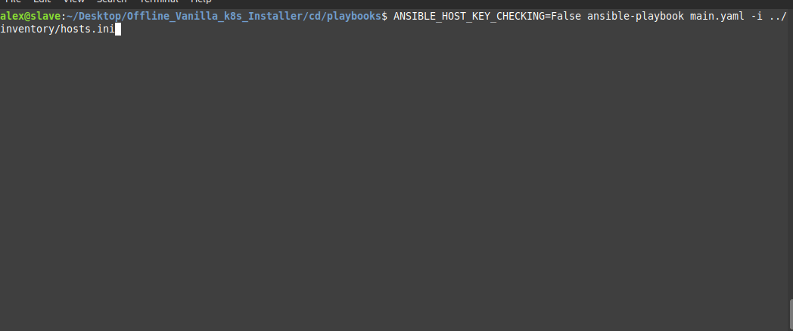
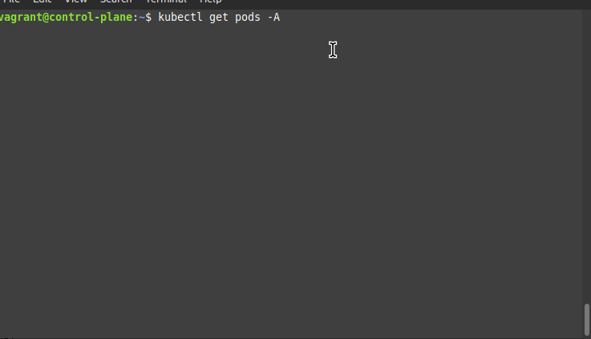

# How to Use guide

### Please Follow along

Start by creating the Makeself installer

```
cd build-script
chmod +x makeself.sh
./makeself.sh
```




Than create your Vagrant VMs:

```
cd vagrant
vagrant up --provider=libvirt
```




And lastly, run the ansbile main playbook

```
cd cd/playbooks/
ANSIBLE_HOST_KEY_CHECKING=False ansible-playbook main.yaml -i ../inventory/hosts.ini
```




You can connect to the machines with "vagrant" as username and password

On the control panel node, run this to check if nodes were created

```
kubectl get node
kubectl get pods -A
```




And you're done!

### Notes

- You can remove the ANSIBLE_HOST_KEY_CHECKING=False if you use ssh keys, or you can edit this line into .bashrc to make it permanent
- If you want to make more worker nodes, edit the vagrant file and add more vms, than edit the hosts.ini file and add the new VMs IPs


